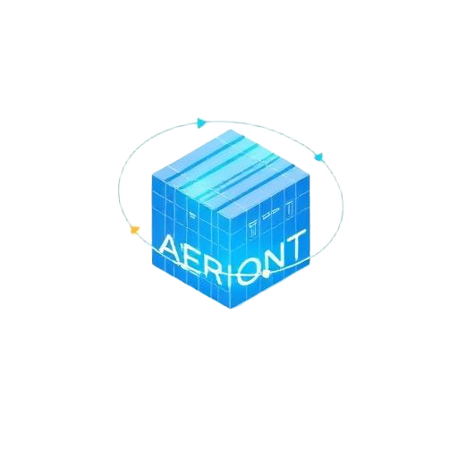

# <p align="center">✦ AERION ✦</p>
<p align="center"><b>Next-Generation Warehouse Command Center</b></p>

<p align="center">
  
</p>

<p align="center">
  
  
  
</p>

---

### 🌑 OVERVIEW
**AERION** is a high-performance, real-time digital twin designed for modern warehouse intelligence. It fuses an immersive **3D Spatial Engine** with predictive analytics, AI-driven insights, and temporal replay to provide operators with a comprehensive **Operational Command Center**.

---

### 🛰️ INTELLIGENCE MODULES

#### 🧊 SPATIAL ACTIVITY TWIN
A high-fidelity **Three.js** engine rendering the warehouse floor in 1:1 scale.
*   **LIVE TELEMETRY** — Real-time AGV tracking and fleet status.
*   **BOTTLENECK HEATMAPS** — D3-powered visualization of floor congestion.
*   **HIGH-CONTRAST HUD** — Non-scrolling interface for maximum data visibility.

#### 🛡️ SHIELD OPS (SAFETY)
Advanced monitoring for floor compliance and hazard distribution.
*   **LIDAR FUSION** — AI-driven pedestrian and obstruction detection.
*   **COMPLIANCE LOGS** — Real-time safety scoring and accident-free tracking.
*   **SITE EVACUATION** — Instant, site-wide emergency protocol execution.

#### 📦 NEURAL LOGISTICS
Intelligent SKU management and multi-modal vessel telemetry.
*   **PREDICTIVE REPLENISHMENT** — Stock-out forecasting before it occurs.
*   **DOCK COMMAND** — Automated bay assignment for Truck, Ship, and Air.
*   **INFERENCE MESH** — Real-time throughput (Actual vs. Predicted) analysis.

#### 🌑 ULTIMATE COMMAND SUITE
The dashboard is equipped with four high-frequency telemetry modules:
*   **GLOBAL EVENT TICKER** — Site-wide marquee streaming real-time logistics alerts.
*   **ENVIRONMENTAL HUD** — Live tracking of weather impact on dock efficiency.
*   **NEURAL WAVEFORM** — Animated voice UI visualizer for AERION AI interaction.
*   **CONNECTIVITY MESH** — Real-time IT health and AGV sync monitoring.

---

### 🛠️ CORE STACK

<p align="left">
  
  
  
  
  
  
</p>

*   **ENGINE** — React 19 + TypeScript (TanStack Start)
*   **VISUALS** — Three.js / WebGL / Framer Motion 12
*   **ANALYTICS** — D3.js / Recharts High-Precision
*   **STYLING** — Tailwind CSS (Sky Blue / Pure Black)

---

### 🌑 DESIGN PHILOSOPHY
AERION utilizes a **High-Contrast / Zero-Gray** design system:
*   **BACKGROUND** — Pure Black (`#000000`) for depth and focus.
*   **ACCENTS** — Sky Blue (`#0ea5e9`) for active telemetry.
*   **TYPOGRAPHY** — Pure White Bold for maximum data readability.

---

### 🚀 DEPLOYMENT

#### 🌍 Netlify (Recommended)
This project is pre-configured for Netlify deployment using `netlify.toml`.
1.  Connect your repository to Netlify.
2.  Build Command: `npm run build`
3.  Publish Directory: `dist/client`
4.  Environment: Node.js 20+

#### 💻 Local Development
```bash
# Install dependencies
npm install

# Launch Command Center
npm run dev
```

---
<p align="center"><b>AERION Twin Engine v1.0.5</b><br/>Optimized for Stockholm Site-7 Operational Mesh</p>
